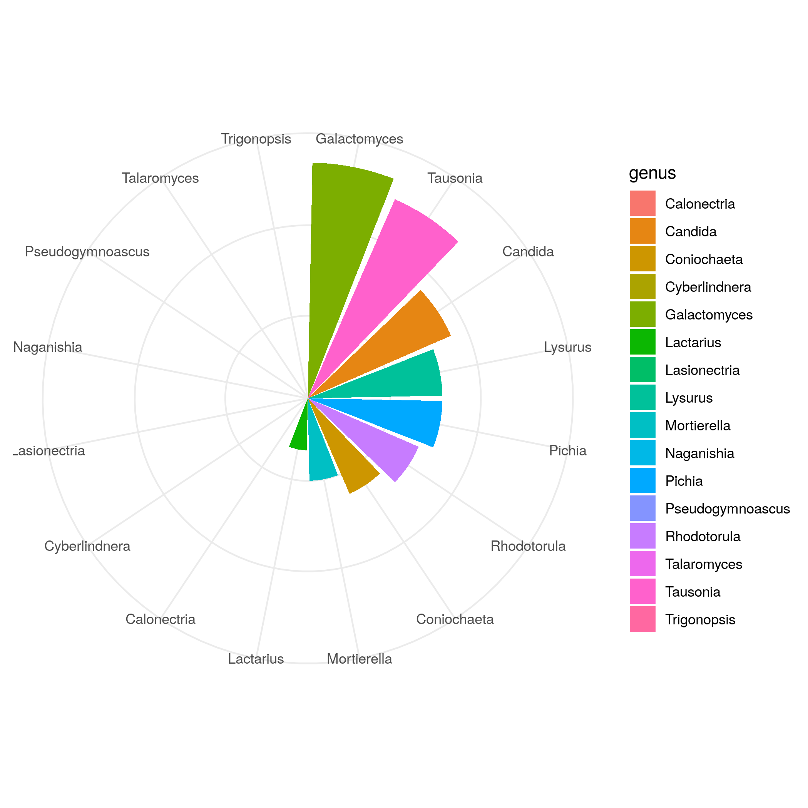

# its_blast_demo
Demonstrate the use of Make and Docker in a simple bioinformatics workflow

Using data from this publication:
https://www.ncbi.nlm.nih.gov/pmc/articles/PMC4778662/

To run the entire project:
```
make results/report.tsv
```

Genus abundances:

