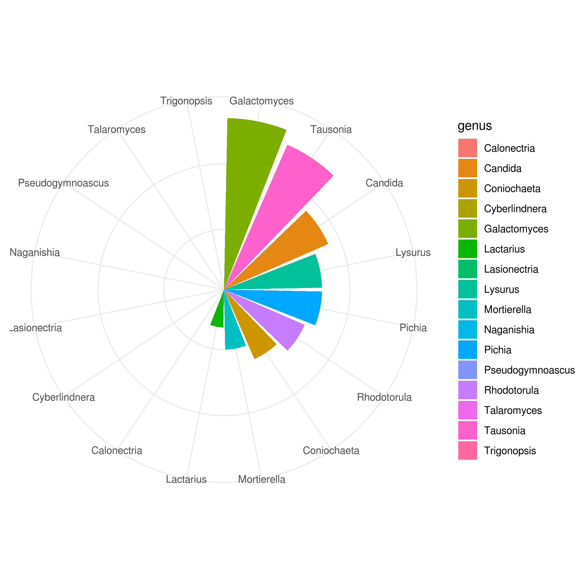

## Introduction

Serofluid dish is a fermented food traditionally prepared in China. The microbial community responsible for the 
fermentation process is little understood. Chen et al. generated fungal ITS sequence data from 12 serofluid dish samples 
and shared the resulting data and analysis in a publication <https://www.ncbi.nlm.nih.gov/pmc/articles/PMC4778662/>.
The goal of this report is to analyze the fungal composition of one particular sample given the most up-to-date 
Fungal ITS reference database from the [National Center for Biotechnology Information](https://www.ncbi.nlm.nih.gov/) (NCBI).

## Results

Raw sequencing reads were downloaded from NCBI and blast was used to compare them to the most recent [fungal ITS database](ftp://ftp.ncbi.nlm.nih.gov/refseq/TargetedLoci/Fungi/). Genus and species were extracted from entries in the 
database and counted to produce the figure below (count data was log-transformed). The two most abundant genera were *Galactomyces* and *Tausonia*.

